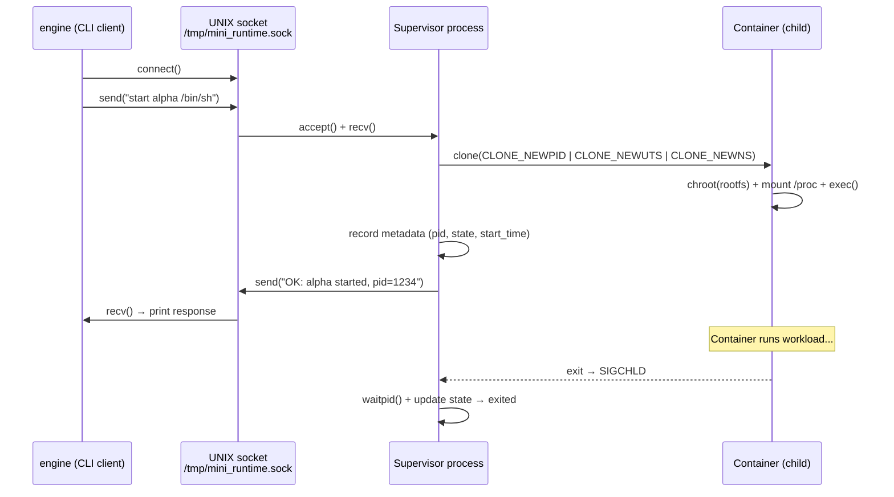
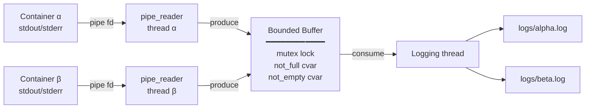
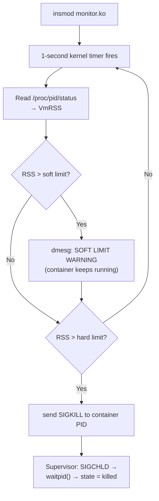

# OS JACKFRUIT

<div align="center">


**A lightweight Docker-like container runtime built from scratch in C.**  


</div>

---

## How It Works in 30 Seconds

- **`engine supervisor`** starts a long-running process that owns all container lifecycle — spawning, reaping, and state tracking
- **`engine start <name>`** calls `clone()` with Linux namespace flags, `chroot()`s into an Alpine rootfs, and mounts `/proc` — giving each container its own PID, UTS, and mount namespace
- **Pipes + bounded buffer** capture container stdout/stderr asynchronously; a dedicated logging thread drains the buffer to per-container log files
- **`monitor.ko`** is a kernel module that fires a 1-second timer per container, reads `/proc/<pid>/status` for RSS, and sends `SIGKILL` (or logs a soft warning) when limits are exceeded
- **A UNIX domain socket** at `/tmp/mini_runtime.sock` carries all CLI commands (`start`, `stop`, `ps`, `logs`) to the supervisor and returns responses

---

## System Architecture

```
┌─────────────────────────────────────────────────────────────────────┐
│                          USER SPACE                                 │
│                                                                     │
│   ┌──────────────┐   UNIX socket    ┌──────────────────────────┐   │
│   │  CLI client  │ ◄──────────────► │     Supervisor process   │   │
│   │  engine      │                  │  ┌──────────────────────┐│   │
│   │  start/stop  │                  │  │ metadata_lock        ││   │
│   │  ps/logs     │                  │  │ container list       ││   │
│   └──────────────┘                  │  │ SIGCHLD handler      ││   │
│                                     │  └──────────┬───────────┘│   │
│                                     └─────────────┼────────────┘   │
│                        clone()                    │                 │
│               ┌───────────────────────────────────┘                 │
│               │                                                     │
│   ┌───────────▼──────────┐   ┌──────────────────────────────────┐  │
│   │   Container α        │   │   Container β                    │  │
│   │  PID · UTS · MNT ns  │   │  PID · UTS · MNT ns              │  │
│   │  chroot → Alpine     │   │  chroot → Alpine                 │  │
│   └──────────┬───────────┘   └──────────┬───────────────────────┘  │
│              │  pipe                    │  pipe                     │
│              └──────────┬───────────────┘                           │
│                         ▼                                           │
│              ┌──────────────────────┐                               │
│              │   Bounded Buffer     │  ← mutex + not_empty/full     │
│              │   pipe_reader_thread │     condition variables       │
│              └──────────┬───────────┘                               │
│                         ▼                                           │
│              ┌──────────────────────┐                               │
│              │   Logging thread     │ ──► /logs/<name>.log          │
│              └──────────────────────┘                               │
│                                                                     │
├─────────────────────────────────────────────────────────────────────┤
│                         KERNEL SPACE                                │
│                                                                     │
│   ┌──────────────────────────────────────────────────────────────┐ │
│   │  monitor.ko  │  1s timer  │  RSS check  │  SIGKILL/SIGWARN  │ │
│   │  ioctl ◄──────────────────────────────────── supervisor      │ │
│   └──────────────────────────────────────────────────────────────┘ │
└─────────────────────────────────────────────────────────────────────┘
```

---

## Team Information

| Name | SRN |
|------|-----|
|VIREN JAMES FERNANDES | PES2UG24CS590|
| DIVYANSHU JHA | PES2UG24CS915|

---

## Build, Load, and Run Instructions

### Dependencies

```bash
sudo apt update
sudo apt install -y build-essential linux-headers-$(uname -r)
```

### Prepare Root Filesystem

```bash
cd Container-Runtime
mkdir rootfs
wget https://dl-cdn.alpinelinux.org/alpine/v3.20/releases/x86_64/alpine-minirootfs-3.20.3-x86_64.tar.gz
tar -xzf alpine-minirootfs-3.20.3-x86_64.tar.gz -C rootfs
```

### Build

```bash
cd boilerplate
make
```

This builds `engine`, `monitor.ko`, `memory_hog`, `cpu_hog`, and `io_pulse`.

### Copy Workloads into Rootfs

```bash
cp cpu_hog io_pulse memory_hog ../rootfs/
```

### Load Kernel Module

```bash
sudo insmod monitor.ko
ls -l /dev/container_monitor
```

### Start Supervisor

```bash
# Terminal 1
sudo ./engine supervisor ../rootfs
```

### Launch Containers

```bash
# Terminal 2
sudo ./engine start alpha ../rootfs /bin/hostname
sudo ./engine start beta  ../rootfs /bin/sh
sudo ./engine ps
sudo ./engine logs alpha
sudo ./engine stop alpha
```

### Run a Container in Foreground

```bash
sudo ./engine run mycontainer ../rootfs /cpu_hog 5
```

### Memory Limit Test

```bash
sudo ./engine start memtest ../rootfs /memory_hog 1 500 --soft-mib 3 --hard-mib 6
sudo dmesg | grep memtest
```

### Scheduling Experiments

```bash
# Two CPU-bound containers with different priorities
time sudo ./engine run cpu_normal ../rootfs /cpu_hog 10 --nice 0  &
time sudo ./engine run cpu_nice   ../rootfs /cpu_hog 10 --nice 15 &
wait

# CPU-bound vs I/O-bound
time sudo ./engine run cpu_exp ../rootfs /cpu_hog  10    --nice 0 &
time sudo ./engine run io_exp  ../rootfs /io_pulse 20 200         &
wait
```

### Unload Module and Clean Up

```bash
sudo rmmod monitor
unlink /tmp/mini_runtime.sock
```

> [!WARNING]
> The runtime requires `root` privileges for `clone()` with namespace flags and `insmod`. Never run untrusted workloads without additional seccomp/capability restrictions.

> [!NOTE]
> `chroot` is used for filesystem isolation in this implementation. While sufficient for the project scope, `pivot_root` is the production-grade choice as it prevents privileged escape from the container.

---

## IPC & Control Flow

### CLI → Supervisor command lifecycle



### Pipe → Bounded buffer → Log file



### Memory enforcement (kernel module)



---

## Demo Screenshots

### Screenshot 1 — Multi-container supervision
Two containers (`alpha`, `beta`) running under a single supervisor process alongside previously tracked containers.


### Screenshot 2 — Metadata tracking
`ps` output showing container ID, state, host PID, and start time for all tracked containers.


### Screenshot 3 — Bounded-buffer logging
Log file contents captured through the pipe → bounded buffer → logging thread pipeline. Container hostname output routed to its log file.


### Screenshot 4 — CLI and IPC
`stop` command issued from the CLI client, routed to the supervisor over a UNIX domain socket, supervisor responds and updates state.


### Screenshot 5 — Soft-limit warning
`dmesg` output showing the kernel module emitting a SOFT LIMIT warning when the container's RSS exceeded 3 MiB.


### Screenshot 6 — Hard-limit enforcement
`dmesg` output showing the kernel module killing the container when RSS exceeded 6 MiB. Supervisor metadata updates state to `killed`.


### Screenshot 7 — Scheduling experiment
Two CPU-bound containers run simultaneously with `nice=0` and `nice=15`. The lower-priority container took ~2× longer to complete the same workload.


### Screenshot 8 — Clean teardown
Supervisor exits cleanly on `SIGINT`. No zombie processes remain. Container states reflect final exit conditions.


---
 
## Engineering Analysis

### 4.1 Isolation Mechanisms

Each container is created using `clone()` with `CLONE_NEWPID`, `CLONE_NEWUTS`, and `CLONE_NEWNS` flags. These give the container its own PID namespace (processes inside see themselves starting at PID 1), its own UTS namespace (allowing a distinct hostname), and its own mount namespace (so filesystem mounts don't leak to the host). After `clone()`, the child calls `chroot()` into the Alpine rootfs, then mounts `/proc` inside the new mount namespace so process visibility works correctly inside the container.

The host kernel is still fully shared — all containers run on the same kernel, share the same physical memory management, and are subject to the same scheduler. Namespaces provide isolation of *views*, not true separation. The host can always see all container processes by their host PIDs.

### 4.2 Supervisor and Process Lifecycle

The long-running supervisor is essential because it maintains the authoritative state of all containers. Without a persistent parent, there is no process to reap children (causing zombies), no place to store metadata, and no endpoint for the CLI to talk to.

Each container is created via `clone()` making the supervisor its direct parent. When a container exits, the kernel delivers `SIGCHLD` to the supervisor. The `sigchld_handler` calls `waitpid(-1, &status, WNOHANG)` in a loop to reap all exited children and update their metadata. The `stop_requested` flag distinguishes a graceful stop (supervisor sent SIGTERM) from a hard limit kill (kernel sent SIGKILL) from a natural exit.

### 4.3 IPC, Threads, and Synchronization

The runtime uses two IPC mechanisms. A pipe per container carries stdout/stderr from the container to a `pipe_reader_thread` in the supervisor. A UNIX domain socket (`/tmp/mini_runtime.sock`) carries CLI commands and responses between the client process and the supervisor.

The bounded buffer sits between the pipe reader threads (producers) and the logging thread (consumer). Without synchronization, producers and the consumer would race on `head`, `tail`, and `count`, causing lost data or corruption. A `pthread_mutex` protects all accesses to the buffer struct. Two condition variables — `not_empty` and `not_full` — allow producers to block when the buffer is full and the consumer to block when it is empty, avoiding busy-waiting. The container metadata list is protected by a separate `metadata_lock` mutex, kept distinct from the buffer lock to avoid deadlock between the logging path and the CLI command path.

### 4.4 Memory Management and Enforcement

RSS (Resident Set Size) measures the physical memory currently mapped and present in RAM for a process. It does not include swapped-out pages, shared libraries counted once across processes, or memory that has been allocated but not yet touched (due to lazy allocation). RSS is therefore a conservative but practical measure of actual memory pressure a process is causing.

Soft and hard limits serve different purposes. The soft limit is a warning threshold — it signals that a container is approaching its budget without terminating it, giving the runtime or operator a chance to react. The hard limit is a hard enforcement boundary — the process is killed when it crosses it. Enforcement belongs in kernel space because user-space monitoring is inherently racy: by the time a user-space monitor reads RSS and decides to kill a process, the process could have allocated significantly more memory. The kernel module's timer fires every second and can send SIGKILL atomically within the same execution context as the RSS check.

### 4.5 Scheduling Behavior

Linux uses the Completely Fair Scheduler (CFS) which allocates CPU time proportionally based on each task's weight. The `nice` value maps to a weight: `nice=0` gets a baseline weight of 1024, while `nice=15` gets a significantly lower weight, meaning CFS gives it proportionally less CPU time when competing with a higher-priority process.

Our experiments confirmed this. Two identical `cpu_hog` processes running for 10 seconds each completed in 9.3s (`nice=0`) and 19.3s (`nice=15`) respectively when running simultaneously — the lower-priority container effectively got half the CPU share. In the CPU vs I/O experiment, the CPU-bound container finished in 4s while the I/O-bound container took 13s. The CPU-bound process got more CPU time because the I/O-bound process was frequently sleeping between write iterations, voluntarily yielding the CPU. CFS correctly identified the I/O-bound process as less CPU-hungry and prioritized the CPU-bound one when it was runnable.

---

## Design Decisions and Tradeoffs

### Namespace Isolation

**Choice:** `CLONE_NEWPID | CLONE_NEWUTS | CLONE_NEWNS` with `chroot`.

**Tradeoff:** `chroot` is simpler to implement than `pivot_root` but is less secure — a privileged process inside the container could potentially escape.

**Justification:** For this project's scope, `chroot` provides the required filesystem isolation without the complexity of `pivot_root`.

---

### Supervisor Architecture

**Choice:** Single long-running supervisor process with a UNIX socket accept loop.

**Tradeoff:** The accept loop handles one request at a time sequentially. Concurrent CLI commands (e.g., two simultaneous `start` calls) are serialized. A threaded accept loop would handle this better.

**Justification:** Sequential handling is safe, simple, and sufficient for the demo workload. It avoids concurrency bugs in the command dispatch path.

---

### IPC and Logging

**Choice:** Pipes for log data, UNIX domain socket for control commands.

**Tradeoff:** Log data is limited to `CONTROL_MESSAGE_LEN` bytes in the response. For large logs, streaming over a second socket would be better.

**Justification:** Two distinct channels keeps log throughput and control latency independent. A single channel for both would mean large log reads could block CLI responsiveness.

---

### Kernel Monitor

**Choice:** Mutex-protected linked list with a 1-second periodic timer.

**Tradeoff:** A 1-second polling interval means a process could exceed its hard limit by up to 1 second's worth of allocations before being killed.

**Justification:** A mutex is appropriate here because the timer callback and ioctl handler can sleep (they run in process context), making a spinlock unnecessary. The 1-second interval is a reasonable tradeoff between enforcement latency and kernel overhead.

---

### Scheduling Experiments

**Choice:** Used `nice` values rather than CPU affinity for priority experiments.

**Tradeoff:** `nice` affects scheduling weight but both processes still run on all CPUs. CPU affinity would isolate them more strictly but would require a multi-core setup to observe meaningful differences.

**Justification:** `nice` directly exercises CFS weight-based scheduling which is the core Linux scheduling mechanism, making the results more illustrative of scheduler behavior.

---

## Scheduler Experiment Results

### Experiment 1 — Two CPU-bound containers with different priorities

Both containers ran `/cpu_hog 10` (burn CPU for 10 seconds) simultaneously.

| Container | Nice Value | Wall Time | CPU Share |
|-----------|-----------|-----------|-----------|
| `cpu_normal` | 0 | **9.295s** | ~67% |
| `cpu_nice` | 15 | **19.295s** | ~33% |

> The `nice=15` container took approximately **2× longer** to complete the same workload. CFS assigned `cpu_normal` roughly twice the CPU share of `cpu_nice` due to the weight difference between `nice=0` and `nice=15`.

### Experiment 2 — CPU-bound vs I/O-bound container

| Container | Type | Wall Time | Why |
|-----------|------|-----------|-----|
| `cpu_exp` | CPU-bound (`nice=0`, 10s) | **4.063s** | Got extra CPU time while `io_exp` slept |
| `io_exp` | I/O-bound (20 iter × 200ms sleep) | **13.169s** | Woke up to scheduling delays behind `cpu_exp` |

> The CPU-bound container finished significantly faster than its 10-second target because the I/O-bound container spent most of its time sleeping. CFS detected that the I/O-bound process was not consuming its full CPU quota and gave the CPU-bound process more time. These results demonstrate two core CFS properties: **weight-based fairness under contention**, and **throughput-oriented behavior** where sleeping processes do not block CPU-hungry ones.

```
Experiment 1: nice priority
  cpu_normal (nice=0)  ████████████░░░░░░░░░░  9.3s
  cpu_nice   (nice=15) ████████████████████░░  19.3s
                       0s        10s       20s

Experiment 2: CPU vs I/O bound
  cpu_exp (CPU-bound)  ████░░░░░░░░░░░░░░░░░░  4.1s
  io_exp  (I/O-bound)  █████████████░░░░░░░░░  13.2s
                       0s        10s       20s
```

---

## Known Limitations & Future Work

| Area | Current Limitation | Production Fix |
|------|--------------------|----------------|
| **Filesystem isolation** | `chroot` — privileged escape possible | Replace with `pivot_root` + drop `CAP_SYS_CHROOT` |
| **CLI concurrency** | Sequential accept loop — concurrent commands serialized | Threaded accept loop with per-command goroutine/thread |
| **Log streaming** | Logs capped at `CONTROL_MESSAGE_LEN` bytes per response | Dedicated streaming socket for log tailing |
| **Memory polling** | 1-second interval — process can over-allocate for up to 1s | Reduce to 100ms, or hook into kernel memory pressure notifiers |
| **Namespace coverage** | Only PID, UTS, MNT — no network, user, or IPC namespaces | Add `CLONE_NEWNET`, `CLONE_NEWUSER`, `CLONE_NEWIPC` |
| **Cgroups** | RSS tracked but not cgroup-enforced | Use cgroups v2 for memory, CPU, and I/O accounting |
| **Security** | No seccomp filter, full syscall surface exposed | Apply seccomp allowlist (e.g., libseccomp) on container exec |

---

<div align="center">

Built for the Operating Systems course — PES University, 2024  
Licensed under the Apache 2.0 License

</div>
